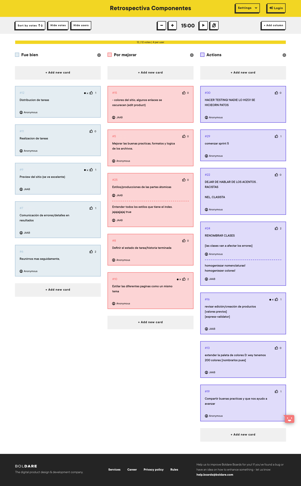

# Retrospectiva Sprint 4

Se presenta un resumen de lo realizado en la dinámica de *"estrella de mar"* en forma de tabla.

| Punto a tratar    |     Oz     |  Charly |Ángel|
|----------|-------------|------|---|---|
| Comenzar a hacer   | Revisar el diseño responsive del sitio   para mobile y desktop. | Diseño del sitio y componentes átomicos   Organizar tiempos. | CSS desarrollados y acordes a la página. |
| Hacer más          | Hablar como devs, discutir más la estructura del sitio.  | Más estricto con tiempos   invertir tiempo. | Homogenizar el estilo del sitio. |
| Continuar haciendo | Participar en llamadas y chat para ayudar en tareas resagadas. |  Trabajar como si fuera el producto final.  |  Emplear nomenclaturas para las clases de HTML. |
| Hacer menos        | Asumir que todos saben de lo que hablamos. |   Menos incongruencia en el nombramiento de las clases HTML. | Evitar tanto copy-paste propio. |
| Dejar de hacer     | Dejar de ir rápido en el proyecto,   en su lugar escuchar. | Dejar cosas hasta el último | Desconcentrarse en el proyecto. |

## Board
